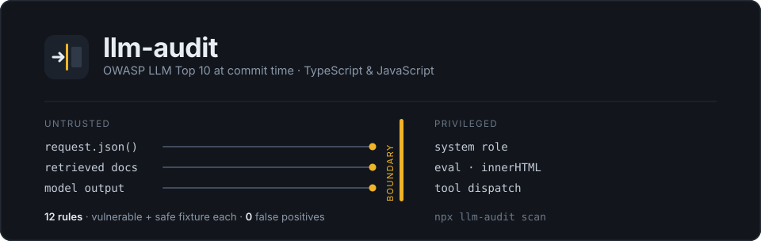

<p>
  <a href="https://www.npmjs.com/package/llm-audit"></a>
  <a href="https://www.npmjs.com/package/llm-audit"></a>
  <a href="https://github.com/Javierlozo/llm-audit/actions/workflows/tests.yml"></a>
  <a href="https://github.com/Javierlozo/llm-audit/blob/main/LICENSE"></a>
</p>

> Static analysis for **TypeScript and JavaScript** LLM-application code.
> Twelve rules mapped to the OWASP LLM Top 10, run at commit time.

```bash
brew install semgrep     # the engine, one-time (or: pipx install semgrep)
npm i -D llm-audit
npx llm-audit demo       # watch the twelve rules fire on bundled fixtures
```

<p>
  
  <br/>
  <sub>A real run against a real chat route handler — regenerated from live CLI output by
  <code>npm run demo:svg</code>, not drawn by hand. Every finding carries its OWASP mapping,
  the risk, and the fix. (Motion honours <code>prefers-reduced-motion</code>.)</sub>
</p>

<p>
  <a href="#quickstart">Quickstart</a>
  ·
  <a href="#rules">Rules</a>
  ·
  <a href="#why-not-just-pai-best-practices">vs. Semgrep</a>
  ·
  <a href="#a-report-you-can-hand-to-someone-else">Report</a>
  ·
  <a href="#machine-readable-output-ci-agents-dashboards">JSON / SARIF</a>
  ·
  <a href="#adopt-in-your-project">Adopt in CI</a>
  ·
  <a href="#using-with-claude-code-cursor-or-codex-cli">Agents</a>
  ·
  <a href="docs/RULES.md">Rule Docs</a>
</p>

---

A focused Semgrep rule pack and CLI for the security failure modes that show up
in TypeScript and JavaScript code when AI coding assistants — and humans —
integrate LLM features. Runs locally before commits and in CI. Engine is
[Semgrep](https://semgrep.dev); output is human-readable, JSON, SARIF 2.1.0, or
a standalone HTML report.

**Status:** the v1 rule set is complete — twelve rules, each with a vulnerable
and a safe fixture, all green against `npm test`.

- [`docs/RULES.md`](docs/RULES.md) — every rule: what it catches, why an AI
  assistant writes the pattern, the fix
- [`docs/AI-FAILURE-MODES.md`](docs/AI-FAILURE-MODES.md) — the long-form rationale
- [`docs/COMPETITIVE-LANDSCAPE.md`](docs/COMPETITIVE-LANDSCAPE.md) — the other
  scanners, and the tools that are **not** competitors
- [`docs/BRIEF.md`](docs/BRIEF.md) — the project pitch

## Why not just `p/ai-best-practices`?

Because it does not scan TypeScript. Semgrep's official AI pack is real and
good — it is simply Python-first. Run both; they do not overlap.

| | `llm-audit` | Semgrep `p/ai-best-practices` |
|---|---|---|
| **JS / TS rules** | **12** | **0** of 27 |
| Language focus | TypeScript, TSX, JavaScript | Python (13), config (11), Bash (3) |
| Findings on this repo's TS/TSX fixtures | **42** | **0** — every target filtered out before scanning |
| Runs at | pre-commit hook + CI | CI |

Reproduce those numbers yourself in under a minute:

```sh
git clone https://github.com/Javierlozo/llm-audit.git && cd llm-audit

# Semgrep's AI pack against the same TypeScript fixtures: 0 targets, 0 findings.
semgrep --config p/ai-best-practices test/fixtures/ --metrics=off

# llm-audit against them: 12 rules, 42 matches, 0 false positives.
npm test
```

The full comparison — false-positive rates, output formats, licensing, the
other OSS scanners, and the commercial landscape — is in
[`docs/COMPETITIVE-LANDSCAPE.md`](docs/COMPETITIVE-LANDSCAPE.md).

<sub>Built by <a href="https://www.luislozoya.com">Luis Javier Lozoya</a> ·
<a href="https://www.luislozoya.com/llm-audit">Project page</a> ·
<a href="https://github.com/Javierlozo/llm-audit/issues">Issues</a> ·
<a href="https://www.npmjs.com/package/llm-audit">npm</a></sub>

## Quickstart

You just ran `npm i llm-audit`. Now what?

```bash
# 1. Install the engine (one-time, system-wide).
brew install semgrep        # or: pipx install semgrep

# 2. Sanity-check setup. Lists missing dependencies and how to fix them.
npx llm-audit doctor

# 3. See what the rules catch in 5 seconds. No setup in your repo.
npx llm-audit demo

# 4. Run on your own code.
npx llm-audit scan
```

That's enough to evaluate whether `llm-audit` is worth adopting. To make
it permanent, see **Adopt in your project** below.

## Machine-readable output (CI, agents, dashboards)

`scan` supports two machine-readable output formats for non-human consumers
(and a human-readable HTML report, covered below):

```bash
# Versioned JSON envelope (stable schema, schemaVersion: 1).
# Useful for AI agents (Claude Code, Cursor) and custom dashboards.
npx llm-audit scan --json src > findings.json

# SARIF 2.1.0, the standard for security-tool output.
# Upload directly to GitHub Code Scanning via codeql-action/upload-sarif.
npx llm-audit scan --sarif src > findings.sarif
```

### A report you can hand to someone else

```bash
npx llm-audit scan --html llm-audit-report.html src
```

One self-contained HTML file — no scripts, no network, no assets — that opens
from disk, prints cleanly, and survives being attached to a PR or kept as a CI
artifact. It groups findings under the rule that explains them and carries, for
each one: what the rule catches, **why an AI assistant tends to write the
pattern**, how to fix it, and the pack's own `safe.*` fixture as a worked
example. That fixture is not illustrative — `npm test` asserts on every commit
that it produces zero findings, so the fix in the report is a fix that is
checked.

The same material is one command away in the terminal:

```bash
npx llm-audit rules hardcoded-llm-api-key
```

### Focusing a run

```bash
npx llm-audit scan --rule hardcoded-llm-api-key src   # one rule
npx llm-audit scan --severity error src               # errors only
npx llm-audit scan --compact src                      # one line per finding
```

Past 15 findings the terminal switches to compact on its own — the full
rationale for every hit stops teaching and starts scrolling. Filtered output is
always labelled as filtered, in the terminal and inside the HTML report, so a
narrow pass is never mistaken for a clean bill of health.

Adopting on a repo that already has findings? Print the whole report but
only fail the build on the severities you are ready to enforce, then tighten
the level as you burn the backlog down:

```bash
npx llm-audit scan --fail-on error src   # report all, exit 1 only on errors
npx llm-audit scan --fail-on never src   # report all, never fail the build
```

JSON envelope shape:

```jsonc
{
  "schemaVersion": 1,
  "tool": { "name": "llm-audit", "version": "0.4.0" },
  "scannedPaths": ["src"],
  "summary": { "findings": 0 },
  "findings": [
    {
      "ruleId": "model-output-parsed-without-schema",
      "severity": "WARNING",
      "owasp": "LLM02",
      "cwe": ["CWE-20"],
      "path": "src/app/api/route.ts",
      "startLine": 61,
      "endLine": 61,
      "message": "Model output is being parsed with `JSON.parse`...",
      "lines": "..."
    }
  ]
}
```

By default `scan` exits **0** when there are no findings and **1** when there
are, regardless of output format. `--fail-on <level>` moves that threshold
without changing what gets reported.

## Using with Claude Code, Cursor, or Codex CLI

`llm-audit` is built for the exact problem AI coding assistants quietly
introduce, so the highest-leverage place to invoke it is from inside the
assistant itself. Two integration paths.

### 1. Install the Claude Code skill (recommended)

Drop a project-local `SKILL.md` into `.claude/skills/llm-audit/` so any
agent that reads the universal skill format (Claude Code, Cursor, Codex
CLI, Antigravity, Gemini CLI) picks it up automatically:

```bash
npx llm-audit init --skill        # hook + workflow + skill
npx llm-audit init --skill-only   # just the skill
```

The skill tells the agent **when** to invoke `llm-audit` (when editing
files that import `openai`, `@anthropic-ai/sdk`, `ai`, `@ai-sdk/*`, etc.),
**how** to invoke it (`npx llm-audit scan --json`), and **how** to
interpret each rule's findings with the canonical fix per OWASP entry.

### 2. Manual rule for users who don't want the skill file

If you'd rather not commit a `.claude/skills/` file to your repo, paste
this into your agent rules (`CLAUDE.md`, `.cursorrules`, `AGENTS.md`,
or your tool's equivalent) instead:

> Before committing any change that touches LLM-integrated code (imports
> from `openai`, `@anthropic-ai/sdk`, `ai`, `@ai-sdk/*`, or any file
> calling `chat.completions.create` / `messages.create` / `generateText` /
> `streamText`), run `npx llm-audit scan --json` against the changed
> paths. Treat the `findings` array as the authoritative list of issues
> to fix. Each finding has `ruleId`, `owasp`, `severity`, `path`,
> `startLine`, `endLine`, and `message`. Fix the code per the message,
> then re-run until the array is empty. Never bypass the rule by
> suppressing the finding.

Either path works. The skill is a strict superset (more context for the
agent, automatic loading) but requires the file to live in your repo.

The JSON envelope is a stable contract (`schemaVersion: 1`), so agents
can rely on the field names without breaking on a future release.

## Versions and updates

`llm-audit` does **not** check for updates on every run. No background
network calls, no daily cache files, no surprise. The trade-off: you
won't be notified of new versions automatically.

To check whether you're current, run:

```bash
npx llm-audit doctor
```

`doctor` makes one on-demand request to the npm registry and prints
either `is up to date` or `is out of date (latest is N.N.N)` with the
upgrade command. Same network call you'd make manually with
`npm view llm-audit version`, just packaged into the diagnostic.

To upgrade:

```bash
npm i llm-audit@latest
```

## Adopt in your project

`llm-audit init` writes two things: a husky pre-commit hook (local, runs
on every commit) and a GitHub Action workflow (CI, runs on PRs and
pushes). Before writing the local hook, `init` asks for confirmation —
press Enter to accept the default, type `n` to skip the hook and keep
just the GitHub Action.

```bash
npx llm-audit init                     # prompts: Install pre-commit hook? [Y/n]
npx llm-audit init -y                  # skip the prompt, accept default
npx llm-audit init --skill             # also install the Claude Code skill

# If husky isn't already in this project, finish the setup:
npm i -D husky
npm pkg set scripts.prepare='husky'
npm run prepare
```

Non-interactive callers (CI, scripts, piped stdin) skip the prompt and
accept the default automatically — no hangs.

Don't run `npx husky init` after `llm-audit init`: it conflicts with the
pre-commit file `llm-audit init` just wrote. The three lines above use
husky v9's manual setup, which doesn't have that conflict.

`llm-audit init` refuses to overwrite existing files; pass `--force` if
you really mean it. Threat model and rationale in
[`docs/SECURITY-AUDIT.md`](docs/SECURITY-AUDIT.md).

### Pinning the version in CI

The bundled GitHub Action runs `npx llm-audit scan`, which resolves the
latest published version from npm at workflow run time unless `llm-audit`
is in your `devDependencies`. The husky pre-commit hook uses
`npx --no-install` and won't fetch the package implicitly.

If you want CI to use a reviewed version rather than whatever is current
on the registry, either add it to your dev dependencies:

```bash
npm i -D llm-audit
```

…or pin a version directly in the workflow file:

```yaml
- run: npx llm-audit@0.4.0 scan
```

## Why

The strongest existing rule pack — Semgrep's official
[`p/ai-best-practices`](https://github.com/semgrep/semgrep-rules/tree/develop/ai/ai-best-practices) —
ships 27 rules: 13 Python, 11 generic configs (MCP, Claude Code settings),
3 Bash hook rules, and **zero JavaScript or TypeScript rules**. Run it
against a Next.js + Vercel AI SDK repo and it returns nothing.

The TypeScript / JavaScript LLM-app ecosystem (Vercel AI SDK, OpenAI /
Anthropic JS SDKs, Next.js route handlers, Server Actions, AI Gateway) is
genuinely underweighted in the static-analysis tooling that exists today.
`llm-audit` fills that gap, with each rule mapped explicitly to an
[OWASP Top 10 for LLM Applications](https://owasp.org/www-project-top-10-for-large-language-model-applications/)
category.

Patterns covered:

- User input flowing into an LLM `system` role or prompt template
- Model output piped into `eval`, `dangerouslySetInnerHTML`, or shell
- `JSON.parse` on raw model output without a schema validator
- Hardcoded LLM API keys in source

The full rule list is in [`docs/RULES.md`](docs/RULES.md).

## Run rules directly with Semgrep (no install needed)

If you don't want to install the package, the rule pack itself is a
plain Semgrep configuration:

```bash
semgrep --config node_modules/llm-audit/rules .
```

## Rules

Twelve rules, each mapped to an [OWASP Top 10 for LLM Applications](https://owasp.org/www-project-top-10-for-large-language-model-applications/)
entry and backed by a vulnerable + safe fixture in `test/fixtures/<rule-id>/`.

| ID | OWASP | Summary |
|---|---|---|
| `untrusted-input-in-system-prompt` | LLM01 | User input placed into the LLM `system` role |
| `untrusted-input-concatenated-into-prompt-template` | LLM01 | User input interpolated into a single-string prompt with no role boundary |
| `untrusted-retrieval-context-in-system-role` | LLM01 | Retrieved documents given system authority — indirect prompt injection |
| `request-body-to-llm-without-schema` | LLM01 | Raw request body reaching an LLM call with no schema validation at the boundary |
| `llm-output-insecure-handling` | LLM02 | Model output flows into `eval`, raw HTML, or shell |
| `model-output-parsed-without-schema` | LLM02 | `JSON.parse` on model output without a schema validator on the path |
| `model-output-rendered-as-markdown-without-sanitization` | LLM02 | Markdown renderer with HTML enabled or sanitization disabled on model output |
| `hardcoded-llm-api-key` | LLM06 | Inline LLM provider API key in source |
| `secrets-in-prompt-context` | LLM06 | Environment secrets interpolated into prompt text sent to the provider |
| `system-prompt-leakage-in-client-bundle` | LLM07 | Prompt-shaped constants inside a `'use client'` module, shipped to the browser |
| `tool-call-dispatch-without-allowlist` | LLM08 | Model-chosen tool name dispatched without an allowlist |
| `streaming-response-without-abort-handling` | LLM10 | Streaming call in a request handler with no `signal` forwarded |

Full rationale for each rule — what it catches, **why an AI assistant tends to
write the pattern**, and the canonical fix — is in [`docs/RULES.md`](docs/RULES.md).
The long-form writeup lives in [`docs/AI-FAILURE-MODES.md`](docs/AI-FAILURE-MODES.md).

## Project layout

```
rules/          Semgrep YAML rules, one per file
src/cli.mjs     CLI entry: scan, demo, doctor, rules, init
src/report.mjs  The standalone HTML report
src/rule-docs.mjs
                Parses docs/RULES.md — the teaching material both the
                `rules <id>` command and the report render
templates/      Files installed by `llm-audit init` (husky hook, GH Action)
test/           Vulnerable + safe fixtures per rule, plus the CLI suite
tools/          Dev-only: regenerates the animated README hero
docs/           RULES.md (rule reference, read at runtime), BRIEF.md (pitch),
                AI-FAILURE-MODES.md, COMPETITIVE-LANDSCAPE.md, SECURITY-AUDIT.md
```

## Author

Built by [Luis Javier Lozoya](https://www.luislozoya.com).

## License

MIT. See [LICENSE](LICENSE).

## Trademarks

llm-audit is an independent project and is not affiliated with or endorsed by
Semgrep, Inc. Semgrep is a trademark of Semgrep, Inc. References to the Semgrep
CLI and the `p/ai-best-practices` ruleset are nominative: they describe the
engine this project runs on and the public ruleset this project complements.
