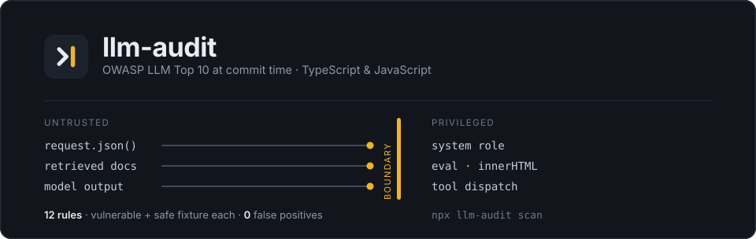
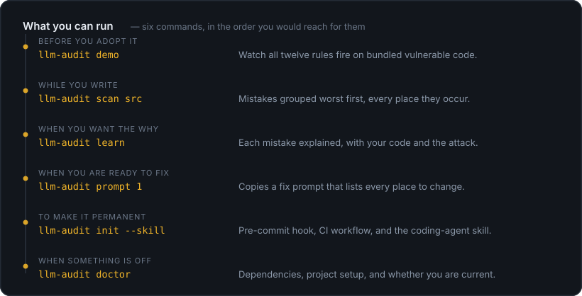

<p>
  <a href="https://www.npmjs.com/package/llm-audit"></a>
  <a href="https://www.npmjs.com/package/llm-audit"></a>
  <a href="https://github.com/Javierlozo/llm-audit/actions/workflows/tests.yml"></a>
  <a href="https://github.com/Javierlozo/llm-audit/blob/main/LICENSE"></a>
</p>

> Static analysis for **TypeScript and JavaScript** LLM-application code.
> Twelve rules mapped to the OWASP LLM Top 10 (2026 edition), run at commit time.

```bash
brew install semgrep     # the engine, one-time (or: pipx install semgrep)
npm i -D llm-audit
npx llm-audit demo       # watch the twelve rules fire on bundled fixtures
```

<p>
  
  <br/>
  <sub>A real run against a real chat route handler. Generated from live CLI output by
  <code>npm run demo:svg</code>, not drawn by hand. Mistakes are grouped worst first, with
  every place they occur. Motion respects <code>prefers-reduced-motion</code>.</sub>
</p>

<p>
  <picture>
    <source media="(prefers-color-scheme: dark)" srcset="https://raw.githubusercontent.com/Javierlozo/llm-audit/main/docs/images/learn-dark.png"/>
    
  </picture>
  <br/>
  <sub><code>npx llm-audit learn</code>: one lesson per mistake, with your own code in it.
  The page is static and runs in your browser; nothing is uploaded.</sub>
</p>

<p>
  <picture>
    <source media="(prefers-color-scheme: dark)" srcset="https://raw.githubusercontent.com/Javierlozo/llm-audit/main/docs/images/learn-fix-dark.png"/>
    
  </picture>
  <br/>
  <sub>Each lesson walks through the attack, then gives a fix prompt that already lists every
  place to change. <code>npx llm-audit prompt 1</code> copies the same prompt from the terminal.</sub>
</p>

<p>
  
</p>

<p>
  <a href="#quickstart">Quickstart</a>
  ·
  <a href="#rules">Rules</a>
  ·
  <a href="#why-not-just-pai-best-practices">vs. Semgrep</a>
  ·
  <a href="#a-report-you-can-hand-to-someone-else">Report</a>
  ·
  <a href="#machine-readable-output-ci-agents-dashboards">JSON / SARIF</a>
  ·
  <a href="#adopt-in-your-project">Adopt in CI</a>
  ·
  <a href="#using-with-claude-code-cursor-or-codex-cli">Agents</a>
  ·
  <a href="docs/RULES.md">Rule Docs</a>
</p>

---

A Semgrep rule pack and CLI for the security bugs that show up in TypeScript
and JavaScript when you wire up an LLM. AI assistants write most of these, but
people write them too. It runs before your commits and in CI. Semgrep is the
engine. Output is human-readable, JSON, SARIF 2.1.0, or a standalone HTML
report.

**Status:** the v1 rule set is done. Twelve rules, each with a vulnerable and a
safe fixture, all green against `npm test`.

- [`docs/RULES.md`](docs/RULES.md) - every rule: what it catches, why an AI
  assistant writes the pattern, and the fix
- [`docs/AI-FAILURE-MODES.md`](docs/AI-FAILURE-MODES.md) - the long version of the reasoning
- [`docs/COMPETITIVE-LANDSCAPE.md`](docs/COMPETITIVE-LANDSCAPE.md) - the other
  scanners, and the ones that aren't competitors at all
- [`docs/BRIEF.md`](docs/BRIEF.md) - the pitch

## Why not just `p/ai-best-practices`?

Because it doesn't scan TypeScript. Semgrep's official AI pack is good work.
It's just Python-first. Run both, they don't overlap.

| | `llm-audit` | Semgrep `p/ai-best-practices` |
|---|---|---|
| **JS / TS rules** | **12** | **0** of 27 |
| Language focus | TypeScript, TSX, JavaScript | Python (13), config (11), Bash (3) |
| Findings on this repo's TS/TSX fixtures | **42** | **0**, every target filtered out before scanning |
| Runs at | pre-commit hook + CI | CI |

Reproduce those numbers yourself in under a minute:

```sh
git clone https://github.com/Javierlozo/llm-audit.git && cd llm-audit

# Semgrep's AI pack against the same TypeScript fixtures: 0 targets, 0 findings.
semgrep --config p/ai-best-practices test/fixtures/ --metrics=off

# llm-audit against them: 12 rules, 42 matches, 0 false positives.
npm test
```

The full comparison is in
[`docs/COMPETITIVE-LANDSCAPE.md`](docs/COMPETITIVE-LANDSCAPE.md): false-positive
rates, output formats, licensing, the other OSS scanners, and the commercial
tools.

<sub>Built by <a href="https://www.luislozoya.com">Luis Javier Lozoya</a> ·
<a href="https://llm-audit.luislozoya.com">Website</a> ·
<a href="https://github.com/Javierlozo/llm-audit/issues">Issues</a> ·
<a href="https://www.npmjs.com/package/llm-audit">npm</a></sub>

## Quickstart

You just ran `npm i llm-audit`. Now what?

```bash
# 1. Install the engine (one-time, system-wide).
brew install semgrep        # or: pipx install semgrep

# 2. Sanity-check setup. Lists missing dependencies and how to fix them.
npx llm-audit doctor

# 3. See what the rules catch in 5 seconds. No setup in your repo.
npx llm-audit demo

# 4. Run on your own code.
npx llm-audit scan
```

That's enough to decide if it's worth keeping. To make it stick, see **Adopt in
your project** below.

## Scan, learn, fix

At a terminal, `scan` groups what it found by kind of mistake, worst first,
with every place each one occurs:

```
llm-audit  ·  scan of . · main @ 4319614d

2 mistakes in 8 places
8 warnings across 6 files

 1  The model's JSON is trusted without checking            warning  5 places
    src/app/api/detectProjects/route.ts      179
    src/app/api/fitAssessment/route.ts       102
    ...

 2  The request body goes to the model unchecked            warning  3 places
    src/app/api/analyzePortfolio/route.ts    39, 84
    src/app/api/interviewQuestions/route.ts  53

Read the lessons, with your code and a fix prompt for each:
  npx llm-audit learn
Copy a fix prompt for your AI tool:  npx llm-audit prompt 1
```

Then two commands work from that scan:

```bash
npx llm-audit learn            # the lessons for your last scan, in your browser
npx llm-audit prompt 1         # copy lesson 1's fix prompt to the clipboard
npx llm-audit prompt 1 --check # the prompt that checks the rest of the project
npx llm-audit prompt 1 | claude -p   # piped, it prints the prompt and nothing else
```

`learn` opens a page with one lesson per mistake, numbered the same as the
terminal. Each lesson shows every place it occurs in your code, explains what
is wrong, walks through how someone would use it against you, and gives you the
fix prompt and the check prompt. You can mark lessons fixed as you go. With no
scan saved for the project, `learn` opens the lesson library: eleven lessons
covering all twelve rules.

Nothing is uploaded. The last scan is saved per project in your user cache
directory, readable only by you, with secret-shaped strings redacted. The page
is one static file whose CSP blocks every network request. Hooks, pipes, and CI
get the per-file output they always have, and save nothing.

```bash
npx llm-audit scan --open      # open the lessons right after the scan
npx llm-audit scan --by file   # per-file view with code, the hook/CI default
npx llm-audit scan --no-link   # don't save the scan, no hints
npx llm-audit learn --link     # a shareable URL for the last scan
npx llm-audit rules            # all twelve rules, grouped by mistake
```

A share link carries the scan in the part of the URL after `#`, which browsers
never send to a server, so it opens on the static page at
`https://llm-audit.luislozoya.com/learn/` without anything being stored there.
The page is built by `node tools/build-site.mjs` and deployed by
`.github/workflows/pages.yml`; to host it yourself, serve that file and point
the CLI at it with `--learn-url <url>` or `LLM_AUDIT_LEARN_URL`.

## Project policy

### Ignoring a finding, with a reason

```ts
// llm-audit-ignore hardcoded-llm-api-key -- fake key, only used in this test
const client = new OpenAI({ apiKey: "sk-test-..." });
```

Put the comment on the flagged line or the line above it. Name the rule (or
several, comma-separated) and say why after `--`. A comment without a reason, or
naming a rule that doesn't exist, is not applied: the finding stays and the
scan tells you what is wrong with the comment. Suppressed findings are counted
under the results and listed with their reasons in `--json`, so a dismissal is
always reviewable. Semgrep's own `// nosemgrep` also works, without a reason.

### Adopting on a repo that already has findings

```bash
npx llm-audit scan --baseline origin/main
```

Only findings that are new since that commit are reported, so you can turn the
gate on today and burn the backlog down separately. It works with uncommitted
changes, and code that merely moved still counts as old. In GitHub Actions, give
the checkout step `fetch-depth: 0` so the ref exists.

### A config file

`.llm-audit.json` at the project root (or an `"llm-audit"` key in
`package.json`) keeps the policy in one place for the hook, CI, and your
terminal. Flags on the command line still win.

```json
{
  "failOn": "error",
  "disable": ["streaming-response-without-abort-handling"],
  "ignore": ["scripts/**", "**/*.test.ts"],
  "baseline": "origin/main"
}
```

The file is strict: an unknown key or rule id is an error, because a typo in a
security tool's config should never read as configured.

### In GitHub Actions

Inside a GitHub Actions job, `scan` also writes each finding as an annotation,
which GitHub shows on the pull request's changed lines, and adds a summary to
the job page. No token or code-scanning setup is needed. `--no-github` turns it
off. `llm-audit init` installs a workflow that runs the scan.

### Exit codes

| Code | Meaning |
|---|---|
| 0 | Nothing at or above `--fail-on` |
| 1 | Findings at or above `--fail-on` |
| 2 | Usage or config error |
| 127 | Semgrep is not installed |

## Machine-readable output (CI, agents, dashboards)

`scan` has two machine-readable formats, plus the HTML report covered below:

```bash
# Versioned JSON envelope (stable schema, schemaVersion: 1).
# Useful for AI agents (Claude Code, Cursor) and custom dashboards.
npx llm-audit scan --json src > findings.json

# SARIF 2.1.0, the standard for security-tool output.
# Upload directly to GitHub Code Scanning via codeql-action/upload-sarif.
npx llm-audit scan --sarif src > findings.sarif
```

### A report you can hand to someone else

```bash
npx llm-audit scan --html llm-audit-report.html src
```

One HTML file. No scripts, no network, no external assets. It opens from disk,
prints cleanly, and survives being attached to a PR or kept as a CI artifact.

It opens with what to fix first and records the branch and commit it's
describing, including whether the tree was dirty when you ran it. Findings are
grouped under the rule that explains them, and each rule carries what it
catches, **why an AI assistant tends to write that pattern**, how to fix it, and
the pack's own `safe.*` fixture as the worked example.

That last part is the one I'd point at. The fixture isn't an illustration.
`npm test` asserts on every commit that it produces zero findings, so the fix in
the report is one that's been checked.

The same material is one command away in the terminal:

```bash
npx llm-audit rules hardcoded-llm-api-key
```

### Focusing a run

```bash
npx llm-audit scan --rule hardcoded-llm-api-key src   # one rule
npx llm-audit scan --severity error src               # errors only
npx llm-audit scan --by file src                      # per file, with code
npx llm-audit scan --by rule src                      # group by rule
npx llm-audit scan --compact src                      # one line per finding
```

Past 15 findings the terminal switches to compact on its own. The full
rationale for every hit stops teaching and starts scrolling. Compact also folds
a rule's repeats in a file onto one row, so you get `lines 18, 22, 27` instead
of three near-identical rows.

Filtered output always says it's filtered, in the terminal and in the HTML
report. A narrow pass should never read like a clean bill of health.

Adopting on a repo that already has findings? Print everything, but only fail
the build on what you're ready to enforce. Tighten it as you burn the backlog
down:

```bash
npx llm-audit scan --fail-on error src   # report all, exit 1 only on errors
npx llm-audit scan --fail-on never src   # report all, never fail the build
```

JSON envelope shape:

```jsonc
{
  "schemaVersion": 1,
  "tool": { "name": "llm-audit", "version": "0.5.0" },
  "repo": { "commit": "…", "shortCommit": "01d9ff30", "branch": "main", "dirty": false },
  "scannedPaths": ["src"],
  "summary": { "findings": 0 },
  "findings": [
    {
      "ruleId": "model-output-parsed-without-schema",
      "severity": "WARNING",
      "owasp": "LLM10",
      "cwe": ["CWE-20"],
      "path": "src/app/api/route.ts",
      "startLine": 61,
      "endLine": 61,
      "message": "Model output is being parsed with `JSON.parse`...",
      "lines": "..."
    }
  ]
}
```

By default `scan` exits **0** with no findings and **1** with any, whatever the
output format. `--fail-on <level>` moves that threshold without changing what
gets reported.

## Using with Claude Code, Cursor, or Codex CLI

Assistants write most of the code these rules were written for, so the best
place to run this is inside the assistant. Two ways to do it.

### 1. Install the Claude Code skill (recommended)

Drop a project-local `SKILL.md` into `.claude/skills/llm-audit/`. Any agent
that reads the universal skill format picks it up on its own: Claude Code,
Cursor, Codex CLI, Antigravity, Gemini CLI.

```bash
npx llm-audit init --skill        # hook + workflow + skill
npx llm-audit init --skill-only   # just the skill
```

The skill tells the agent **when** to run it (editing files that import
`openai`, `@anthropic-ai/sdk`, `ai`, `@ai-sdk/*`), **how** to run it
(`npx llm-audit scan --json`), and how to read each rule's findings with the
right fix per OWASP entry.

### 2. Manual rule for users who don't want the skill file

If you'd rather not commit a `.claude/skills/` file, paste this into your agent
rules instead (`CLAUDE.md`, `.cursorrules`, `AGENTS.md`, or whatever your tool
uses):

> Before committing any change that touches LLM-integrated code (imports
> from `openai`, `@anthropic-ai/sdk`, `ai`, `@ai-sdk/*`, or any file
> calling `chat.completions.create` / `messages.create` / `generateText` /
> `streamText`), run `npx llm-audit scan --json` against the changed
> paths. Treat the `findings` array as the authoritative list of issues
> to fix. Each finding has `ruleId`, `owasp`, `severity`, `path`,
> `startLine`, `endLine`, and `message`. Fix the code per the message,
> then re-run until the array is empty. Never bypass the rule by
> suppressing the finding.

Either works. The skill gives the agent more context and loads on its own, but
the file has to live in your repo.

The JSON envelope is a stable contract (`schemaVersion: 1`), so agents can rely
on the field names without breaking on a future release.

## Versions and updates

It doesn't check for updates on every run. No background network calls, no
daily cache files, nothing you didn't ask for. The trade-off is that you won't
hear about a new version on your own.

To check where you are:

```bash
npx llm-audit doctor
```

`doctor` makes one request to the npm registry and prints either
`is up to date` or `is out of date (latest is N.N.N)` with the upgrade command.
It's the same call you'd make yourself with `npm view llm-audit version`.

To upgrade:

```bash
npm i llm-audit@latest
```

## Adopt in your project

`llm-audit init` writes two things: a husky pre-commit hook that runs on every
commit, and a GitHub Action workflow that runs on PRs and pushes. It asks before
writing the hook, since that one lands in your local commit flow. Press Enter to
accept, type `n` to skip the hook and keep just the workflow.

```bash
npx llm-audit init                     # prompts: Install pre-commit hook? [Y/n]
npx llm-audit init -y                  # skip the prompt, accept default
npx llm-audit init --skill             # also install the Claude Code skill

# If husky isn't already in this project, finish the setup:
npm i -D husky
npm pkg set scripts.prepare='husky'
npm run prepare
```

CI, scripts, and piped stdin skip the prompt and take the default, so nothing
hangs.

Don't run `npx husky init` afterwards. It conflicts with the pre-commit file
`llm-audit init` just wrote. The three lines above are husky v9's manual setup,
which doesn't have that problem.

Run `init` twice and it tells you everything's already installed instead of
failing. It only refuses to overwrite a file it didn't write, and `--force`
reinstalls from the templates either way. Threat model in
[`docs/SECURITY-AUDIT.md`](docs/SECURITY-AUDIT.md).

Want it gone? `npx llm-audit uninstall` removes the hook, the workflow, and the
skill. It only deletes files it can prove it wrote, and tells you what it left
behind.

### Pinning the version in CI

The bundled workflow runs `npx llm-audit scan`, which pulls the latest
published version at run time unless `llm-audit` is in your `devDependencies`.
The pre-commit hook uses `npx --no-install`, so it never fetches the package
behind your back.

If you want CI on a version you've reviewed, either add it to your dev
dependencies:

```bash
npm i -D llm-audit
```

…or pin a version directly in the workflow file:

```yaml
- run: npx llm-audit@0.5.0 scan
```

## Why

The best rule pack out there is Semgrep's official
[`p/ai-best-practices`](https://github.com/semgrep/semgrep-rules/tree/develop/ai/ai-best-practices).
It ships 27 rules: 13 Python, 11 config files (MCP, Claude Code settings),
3 Bash hooks, and **zero JavaScript or TypeScript**. Point it at a Next.js +
Vercel AI SDK repo and it comes back with nothing.

The TS/JS side of this ecosystem is where a lot of LLM code actually ships:
Vercel AI SDK, the OpenAI and Anthropic JS SDKs, Next.js route handlers, Server
Actions, AI Gateway. The static-analysis tooling hasn't caught up. That's the
gap this fills, with every rule mapped to an
[OWASP Top 10 for LLM Applications](https://owasp.org/www-project-top-10-for-large-language-model-applications/)
entry.

Some of what it catches:

- User input flowing into an LLM `system` role or prompt template
- Model output piped into `eval`, `dangerouslySetInnerHTML`, or shell
- `JSON.parse` on raw model output without a schema validator
- Hardcoded LLM API keys in source

The full rule list is in [`docs/RULES.md`](docs/RULES.md).

## Run rules directly with Semgrep (no install needed)

Don't want the package? The rule pack is a plain Semgrep config:

```bash
semgrep --config node_modules/llm-audit/rules .
```

## Rules

Twelve rules, each mapped to an [OWASP Top 10 for LLM Applications](https://owasp.org/www-project-top-10-for-large-language-model-applications/)
entry and backed by a vulnerable + safe fixture in `test/fixtures/<rule-id>/`.

| ID | OWASP | Summary |
|---|---|---|
| `untrusted-input-in-system-prompt` | LLM01 | User input placed into the LLM `system` role |
| `untrusted-input-concatenated-into-prompt-template` | LLM01 | User input interpolated into a single-string prompt with no role boundary |
| `untrusted-retrieval-context-in-system-role` | LLM01 | Retrieved documents given system authority (indirect prompt injection) |
| `request-body-to-llm-without-schema` | LLM01 | Raw request body reaching an LLM call with no schema validation at the boundary |
| `llm-output-insecure-handling` | LLM10 | Model output flows into `eval`, raw HTML, or shell |
| `model-output-parsed-without-schema` | LLM10 | `JSON.parse` on model output without a schema validator on the path |
| `model-output-rendered-as-markdown-without-sanitization` | LLM10 | Markdown renderer with HTML enabled or sanitization disabled on model output |
| `hardcoded-llm-api-key` | LLM02 | Inline LLM provider API key in source |
| `secrets-in-prompt-context` | LLM02 | Environment secrets interpolated into prompt text sent to the provider |
| `system-prompt-leakage-in-client-bundle` | LLM08 | Prompt-shaped constants inside a `'use client'` module, shipped to the browser |
| `tool-call-dispatch-without-allowlist` | LLM03 | Model-chosen tool name dispatched without an allowlist |
| `streaming-response-without-abort-handling` | LLM06 | Streaming call in a request handler with no `signal` forwarded |

[`docs/RULES.md`](docs/RULES.md) has the full reasoning for each one: what it
catches, **why an AI assistant tends to write that pattern**, and the fix. The
long version is in [`docs/AI-FAILURE-MODES.md`](docs/AI-FAILURE-MODES.md).

## Project layout

```
rules/          Semgrep YAML rules, one per file
src/cli.mjs     CLI entry: scan, demo, doctor, rules, init, uninstall
src/report.mjs  The standalone HTML report
src/lessons.mjs One lesson per kind of mistake: the attack, the fix prompt,
                and the check prompt. Plain data, shared with the learn page
src/share.mjs   Packs a scan into the learn link's #fragment, with redaction
src/learn.mjs   Renders the learn page (src/learn/) as one self-contained file
src/rule-docs.mjs
                Parses docs/RULES.md, the material that both the
                `rules <id>` command and the report render
templates/      Files installed by `llm-audit init` (husky hook, GH Action)
test/           Vulnerable + safe fixtures per rule, plus the CLI suite
web/            The website's home page (not shipped to npm)
tools/          Dev only: regenerates the README hero and command map, and
                builds the website: https://llm-audit.luislozoya.com
docs/           RULES.md (rule reference, read at runtime), BRIEF.md (pitch),
                AI-FAILURE-MODES.md, COMPETITIVE-LANDSCAPE.md, SECURITY-AUDIT.md
```

## Author

Built by [Luis Javier Lozoya](https://www.luislozoya.com).

## License

MIT. See [LICENSE](LICENSE).

## Trademarks

llm-audit is an independent project. It isn't affiliated with or endorsed by
Semgrep, Inc. Semgrep is a trademark of Semgrep, Inc. References to the Semgrep
CLI and the `p/ai-best-practices` ruleset are nominative: they name the engine
this runs on and the public ruleset it complements.
